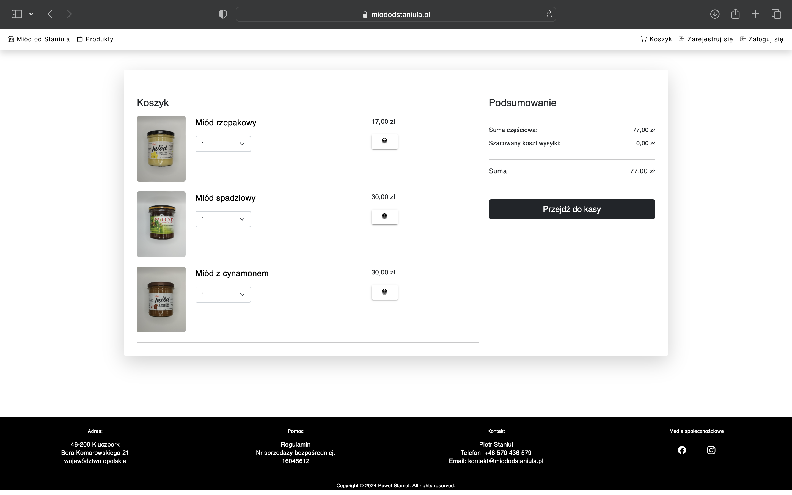
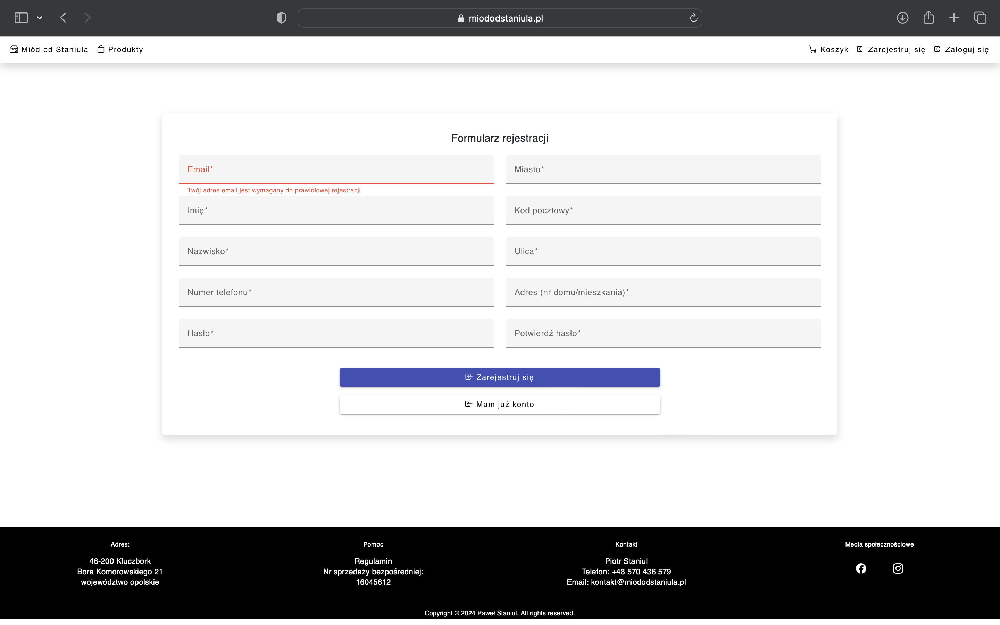
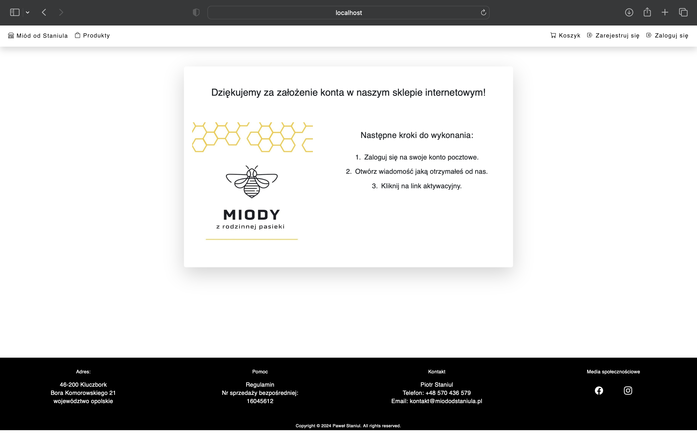
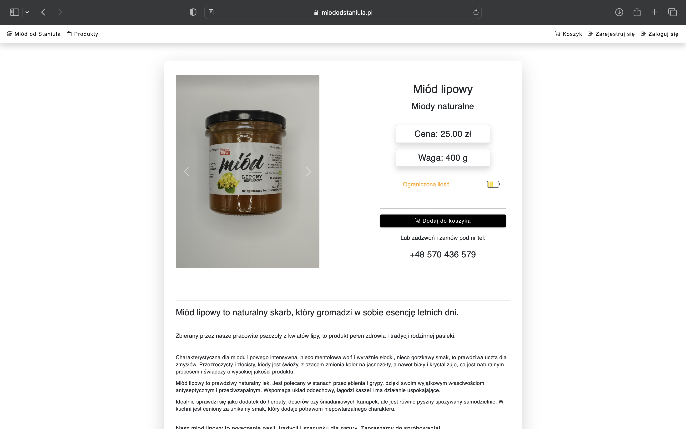

# Miód od Staniula

Opis projektu: Aplikacja `Miód od Staniula` to proste narzędzie e-commerce dla sklepu internetowego oferującego podstawowy zakres produktów. Aplikacja umożliwia użytkownikom przeglądanie produktów, dodawanie ich do koszyka oraz realizację zamówień. Dzięki responsywnemu interfejsowi użytkownika, aplikacja zapewnia płynne i intuicyjne doświadczenie zakupowe na różnych urządzeniach.


## Technologie

Projekt został zbudowany przy użyciu następujących technologii:

- **Frontend**: Angular
- **Backend**: ASP.NET Core Web API
- **Baza danych**: SQL Server
- **Autentykacja i autoryzacja**: JWT (JSON Web Tokens)
- **Inne narzędzia**: Entity Framework Core, AutoMapper, Swagger UI



## Funkcje

Aplikacja oferuje następujące funkcje:

- Przeglądanie produktów z podziałem na kategorie.
- Szczegóły produktu z opcją dodawania do koszyka.
- Koszyk zakupowy z możliwością modyfikacji ilości produktów i usuwania ich z koszyka.
- Proces składania zamówienia z formularzem adresowym.
- Autentykacja i rejestracja użytkownika.
- Panel administracyjny do zarządzania produktami, kategoriami i zamówieniami (opcjonalnie).



## Instalacja i uruchomienie

### Wymagania wstępne

Upewnij się, że masz zainstalowane:

- .NET Core SDK
- Node.js i npm
- SQL Server

### Klonowanie repozytorium

```
git clone https://github.com/Pawel88PL/e-commerce
cd nazwa-aplikacji
```

### Konfiguracja bazy danych

1. Utwórz bazę danych w SQL Server.
2. Zaktualizuj plik `appsettings.json` w projekcie backendowym:

```
{
  "Jwt": {
    "Key": "NazwaTwojegoKlucza",
    "Issuer": "http://localhost:5046",
    "Audience": "http://localhost:4200",
    "ExpireMinutes": 120
  },
  "Logging": {
    "LogLevel": {
      "Default": "Information",
      "Microsoft.AspNetCore": "Warning"
    }
  },
  "ConnectionStrings": {
    "nazwaTwojegoConnectionString": "Data Source=serwerBazyDanych;Database=NazwaBazyDanych;Uid=TwójLogin;Password=TwojeHasło;TrustServerCertificate=True"
  },
  "EmailSettings": {
    "SmtpServer": "serwerTwojejPoczty",
    "SmtpPort": 587,
    "SmtpUsername": "adresEmail",
    "SmtpPassword": "hasłoDoKontaEmail"
  },
    "ApplicationSettings": {
      "BaseUrl": "UrlDoTwojegoApi"
    }
}
```

### Uruchomienie backendu

```
cd ścieżka/do/projektu/backendowego
dotnet restore
dotnet ef database update
dotnet run
```

### Uruchomienie frontendu

```
cd ścieżka/do/projektu/frontendowego
npm install
ng serve
```

Otwórz przeglądarkę i przejdź do `http://localhost:4200/` aby zobaczyć działającą aplikację.



<br>



## Wsparcie

Jeśli masz jakiekolwiek pytania lub potrzebujesz pomocy, napisz do mnie pod adres pstaniul@gmail.com.